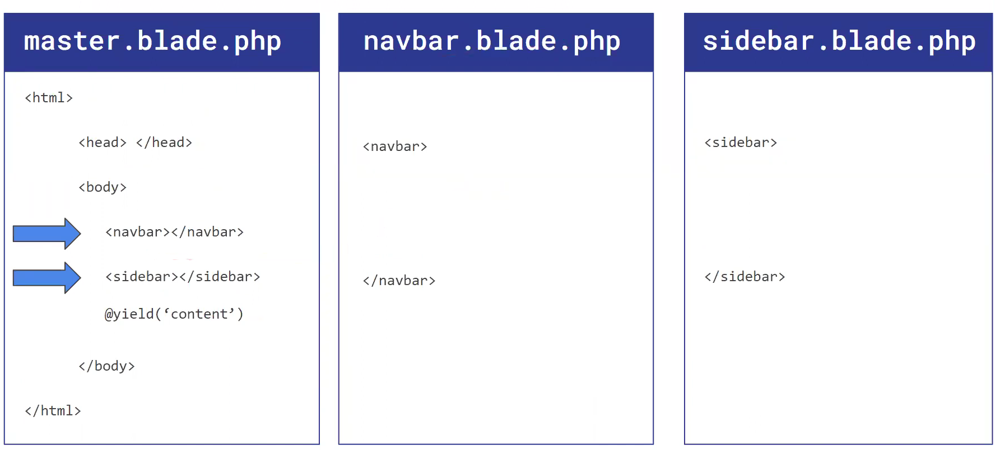
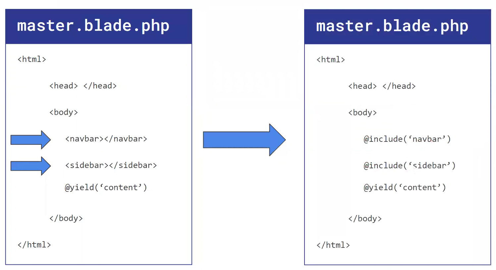
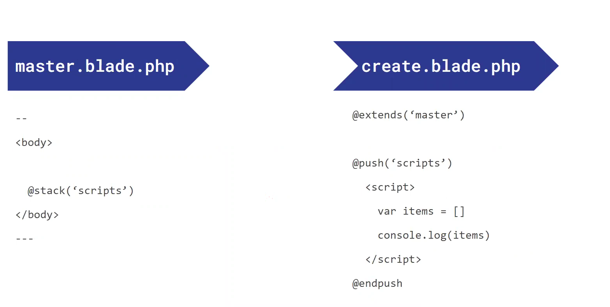

# Membuat Template dengan Blade Laravel

Sisi tampilan depan (frontend) pada web merupakan bagian yang penting dalam menyajikan informasi kepada pengguna. Website yang baik salah satunya adalah karena mengedepankan nilai estetika pada sisi tampilan depannya. Namun, bagi para pengembang tentunya sangat penting membuat tampilan depan yang mudah dikembangkan kembali dan desain yang konsisten.

Permasalahan pada pengembangan sisi frontend contoh kasusnya adalah jika kita menginginkan banyak halaman HTML yang memiliki layout yang serupa dan hanya unik pada bagian kontennya saja maka kita tidak usah menulis ulang bagian-bagian HTML yang layoutnya statis (tidak berubah).

Contohnya di bawah ini, terdapat tiga halaman yaitu index, create dan show yang semuanya memiliki layout yang sama yaitu dibuka dengan tag `<html>`, memiliki bagian `<head>` <navbar> dan `<sidebar>` yang layoutnya sama persis. Hal yang unik dari masing-masing halaman adalah konten yang ada di dalamnya yaitu bagian table di halaman index, bagian form di halaman create, dan bagian card untuk halaman show.


## Membuat Template Utama dengan Blade

Daripada menulis ulang kode untuk bagian yang sama seperti `<head>, <navbar>, <sidebar>` lebih baik jika kita buat sebuah template utama yang di dalam nya terdapat layout yang dapat dipakai kembali oleh halaman-halaman lainnya sehingga meminimalisasi perulangan.


Contoh di atas kita buat sebuah template utama atau parent template dengan nama **master.blade.php** dan kita akan buat halaman anak atau children dengan nama **index.blade.php** . Di dalam **master.blade.php** tersebut kita menulis kode HTML dari tag pembuka `<html>` sampai akhir, juga terdapat bagian navbar dan sidebar yang akan bisa dipakai di halaman lain.

Bagian penting dari parent template yaitu kita sediakan satu tempat atau slot untuk dapat diisi oleh halaman children. cara memberikan slot nya adalah dengan menggunakan directive atau sintaks di Blade Laravel dengan nama `@yield` di dalam function yield tersebut kita masukkan parameter berupa string yaitu nama dari slot yang akan dibuat. Kali ini kita namai slot tersebut dengan **'content'** sehingga menjadi `@yield('content')`.

Sama seperti pada materi OOP untuk membuat class child dari sebuah class lain yaitu menggunakan extends, maka pada halaman **index.blade.php** kita tinggal gunakan sintaks `@extends('master')` agar halaman index mendapatkan seluruh layout dari master template dan mendapatkan slot **'content'** untuk bisa diisi.

Untuk mengisi slot **'content'** pada halaman **index.blade.php**, kita gunakan sintaks `@section('content')` . Namun sintaks section memiliki sintaks penutupnya yaitu `@endsection` .
Di antara pembuka `@section('content')` dan penutup `@endsection` kita bisa sisipkan konten dari halaman index, misalkan kita isi dengan `<table>`.



Selain Dengan layout sebelumnya kita juga dapat memanfaatkan `@include`, sehingga akan membuat **master.blade.php** akan lebih simpel, dikarenakan memecah navbar kedalam satu file **navbar.blade.php** dan sidebar satu file **sidebar.blade.php**, maka file **master.blade.php** akan menjadi seperti dibawah ini:


### Layouts Using Template Inheritance

<a name="defining-a-layout"></a>
#### Defining A Layout

Untuk memulai, lihat contoh dibawah ini, Pertama, kita akan memeriksa tata letak dari halaman. Karena sebagian besar aplikasi web mempertahankan tata letak umum yang sama di berbagai halaman, akan lebih mudah untuk mendefinisikan tata letak ini sebagai satu tampilan Blade:

```blade
<!-- resources/views/layouts/app.blade.php -->

<html>
    <head>
        <title>App Name - @yield('title')</title>
    </head>
    <body>
        @section('sidebar')
            This is the master sidebar.
        @show

        <div class="container">
            @yield('content')
        </div>
    </body>
</html>
```

Seperti yang Anda lihat, file ini berisi mark-up HTML biasa. Namun, perhatikan arahan `@section` dan `@yield`. Direktif `@section`, sesuai dengan namanya, mendefinisikan suatu bagian konten, sedangkan direktif `@yield` digunakan untuk menampilkan konten dari bagian tertentu.

Sekarang kita telah menentukan tata letak untuk aplikasi kita, mari kita tentukan halaman anak yang mewarisi tata letak tersebut.

#### Extending A Layout

Saat menentukan tampilan anak, gunakan direktif Blade `@extends` untuk menentukan tata letak mana yang harus "diwarisi" oleh tampilan anak. Tampilan yang memperluas tata letak Blade dapat memasukkan konten ke dalam bagian tata letak menggunakan arahan `@section`. Ingat, seperti yang terlihat pada contoh di atas, konten bagian ini akan ditampilkan dalam tata letak menggunakan `@yield`:

```blade
<!-- resources/views/child.blade.php -->

@extends('layouts.app')

@section('title', 'Page Title')

@section('sidebar')
    @@parent

    <p>This is appended to the master sidebar.</p>
@endsection

@section('content')
    <p>This is my body content.</p>
@endsection
```

Dalam contoh ini, bagian `sidebar` menggunakan direktif `@@parent` untuk menambahkan (bukan menimpa) konten ke sidebar tata letak. Direktif `@@parent` akan digantikan oleh konten tata letak saat tampilan dirender.

> **Catatan**
> Berbeda dengan contoh sebelumnya, bagian `sidebar` ini diakhiri dengan `@endsection` dan bukan `@show`. Perintah `@endsection` hanya akan mendefinisikan suatu bagian sementara `@show` akan mendefinisikan dan **segera menghasilkan** bagian tersebut.

Direktif `@yield` juga menerima nilai default sebagai parameter kedua. Nilai ini akan diberikan jika bagian yang dihasilkan tidak ditentukan:

```blade
@yield('content', 'Default content')
```

## Stacks



Blade memungkinkan Anda untuk mendorong ke tumpukan bernama yang dapat dirender di tempat lain dalam tampilan atau tata letak lain. Hal ini khususnya berguna untuk menentukan pustaka JavaScript apa pun yang diperlukan oleh tampilan anak Anda:

```blade
@push('scripts')
    <script src="/example.js"></script>
@endpush
```

Jika Anda ingin `@push` konten jika ekspresi boolean tertentu bernilai `true`, Anda dapat menggunakan direktif `@pushIf`:

```blade
@pushIf($shouldPush, 'scripts')
    <script src="/example.js"></script>
@endPushIf
```

Anda dapat push ke stack sebanyak yang diperlukan. Untuk merender isi tumpukan secara lengkap, teruskan nama tumpukan ke direktif `@stack`:

```blade
<head>
    <!-- Head Contents -->

    @stack('scripts')
</head>
```

Jika Anda ingin menambahkan konten ke awal tumpukan, Anda harus menggunakan arahan `@prepend`:

```blade
@push('scripts')
    This will be second...
@endpush

// Later...

@prepend('scripts')
    This will be first...
@endprepend
```

### References

- [Sanbercode](https://sanbercode.com)
- [Laravel Documentation](https://laravel.com/docs/10.x/blade#main-content)


### References Videos
- [Web Programming Unpas Blade Templating Engine](https://www.youtube.com/watch?v=9jrD0wcfq1g)
- [Programmer Zaman Now TUTORIAL LARAVEL BLADE TEMPLATE](https://www.youtube.com/watch?v=cEN1dHwnLP0)


